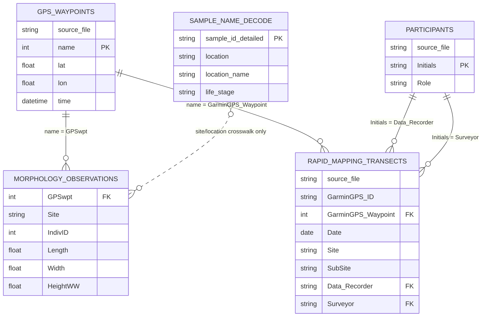

# Data Directory Documentation

This directory contains source data used by the opihi morphology and microhabitat analyses. Data dictionaries for each source file are stored beside the data as `*_data_dictionary.tsv` files with three fields: `column name`, `data description`, and `confidence`.

## File Inventory

| File | Format | Records | Description | Key fields and links | Dictionary |
| --- | --- | ---: | --- | --- | --- |
| `DataOpihiMorphologyMicrohabitat.csv` | CSV | 123 rows | Individual-level morphology and microhabitat observations used by `scripts/readOpihiMicrohabitat.R`. | `GPSwpt` links to waypoint and rapid-mapping records when available; `Site` is a site/subsite label; `IndivID` identifies individuals within the observation table. | `DataOpihiMorphologyMicrohabitat_data_dictionary.tsv` |
| `sample_name_decode.tsv` | TSV | 44 rows | Lookup table for genetic/sample naming, location metadata, management status, shore context, and collection date. | `sample_id_detailed` is the most specific sample identifier. No direct join is currently implemented in the analysis scripts. | `sample_name_decode_data_dictionary.tsv` |
| `Opihi_Mapping_Data_Kahului_Jun2023_ceb.xlsx` | XLSX | 10 rows | Rapid mapping/transect observations for Kahului Breakwater. | `GarminGPS_Waypoint` links to GPX waypoint names and `GPSwpt` values; `Data_Recorder` and `Surveyor` link to participant initials. | `Opihi_Mapping_Data_Kahului_Jun2023_ceb_data_dictionary.tsv` |
| `Opihi_Mapping_Data_Honolua_Jun2023_ceb.xlsx` | XLSX | 39 rows | Rapid mapping/transect observations for Honolua Adjacent. | Same as Kahului mapping file; includes `Transect_Width_ft`. | `Opihi_Mapping_Data_Honolua_Jun2023_ceb_data_dictionary.tsv` |
| `Opihi_Mapping_Data_Kahului_Jun2023_participants.xlsx` | XLSX | 2 rows | Participant lookup for Kahului field work. | `Initials` links to `Data_Recorder` and `Surveyor`. | `Opihi_Mapping_Data_Kahului_Jun2023_participants_data_dictionary.tsv` |
| `Opihi_Mapping_Data_Honolua_Jun2023_participants.xlsx` | XLSX | 2 rows | Participant lookup for Honolua field work. | `Initials` links to `Data_Recorder` and `Surveyor`. | `Opihi_Mapping_Data_Honolua_Jun2023_participants_data_dictionary.tsv` |
| `Waypoints_12-JUN-23.gpx` | GPX | 11 waypoints | Garmin waypoint export for June 12, 2023, waypoint names 048-058. | GPX `name` links to numeric waypoint fields after removing leading zeros. | `Waypoints_12-JUN-23_data_dictionary.tsv` |
| `Waypoints_13-JUN-23.gpx` | GPX | 10 waypoints | Garmin waypoint export for June 13, 2023, waypoint names 059-068. | Same waypoint relationship. | `Waypoints_13-JUN-23_data_dictionary.tsv` |
| `Waypoints_14-JUN-23.gpx` | GPX | 12 waypoints | Garmin waypoint export for June 14, 2023, waypoint names 069-080. | Same waypoint relationship. | `Waypoints_14-JUN-23_data_dictionary.tsv` |

## Relational Model

The relationships below are logical joins for reproducible analysis. They are not enforced by a database in this repository.

## Join and Reproducibility Notes

- GPX waypoint names are zero-padded strings such as `048`; morphology and mapping files store corresponding waypoint IDs as numbers such as `48`.
- The current GPX files cover waypoints 48-80. `DataOpihiMorphologyMicrohabitat.csv` contains additional waypoint IDs, so not every morphology record has a GPX record in this directory.
- The mapping spreadsheets and morphology table can contain multiple rows per waypoint. Treat waypoint joins as one-to-many or many-to-many depending on the analysis.
- The analysis script converts shell dimensions from inches to centimeters, so raw `Length`, `Width`, and `HeightWW` values should be treated as inches unless corrected upstream.
- Preserve raw files. Put cleaning, normalization, and derived variables in scripts so manuscript analyses remain reproducible.
