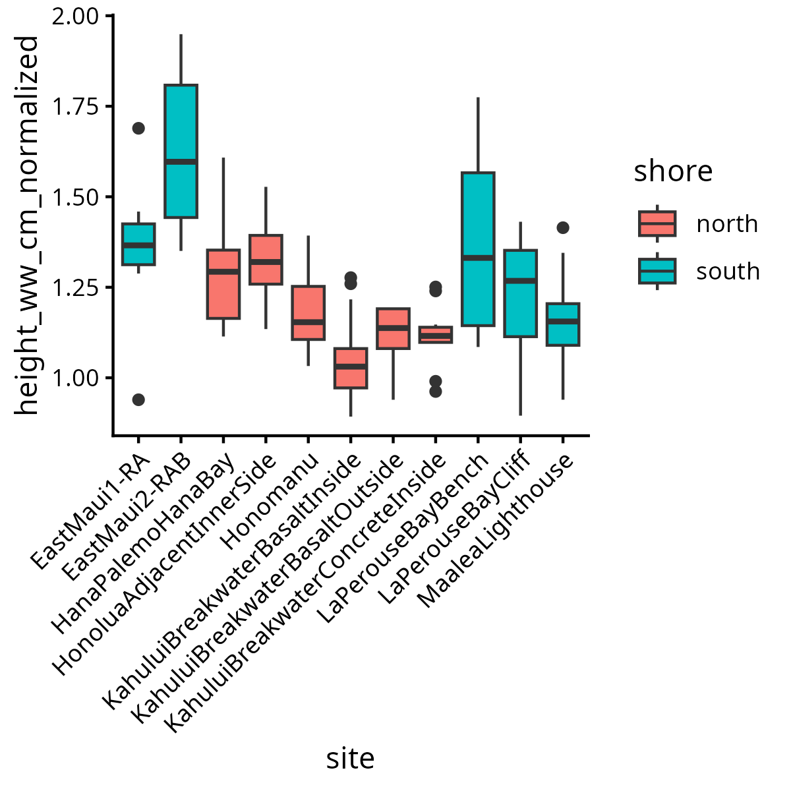
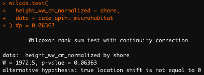
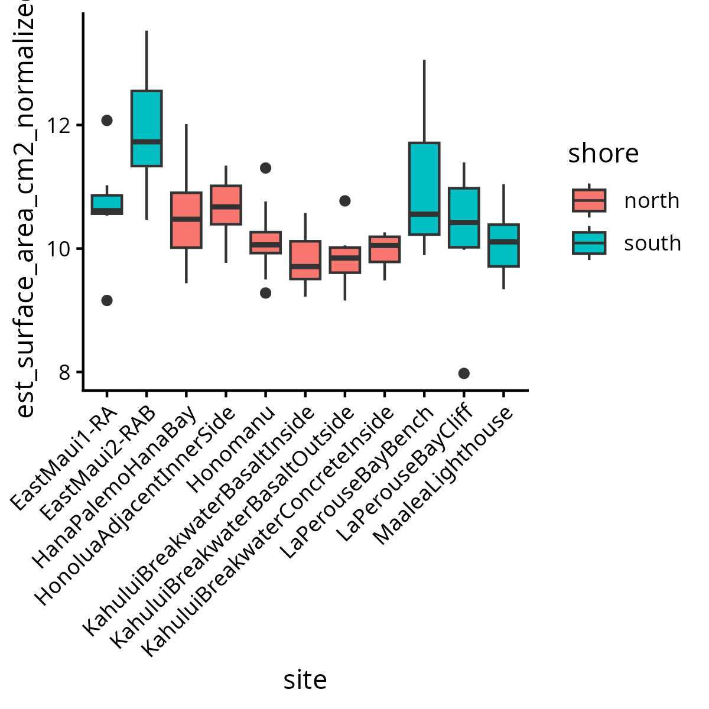
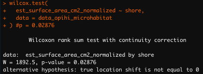
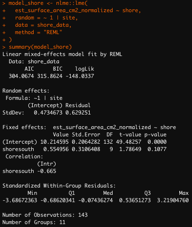
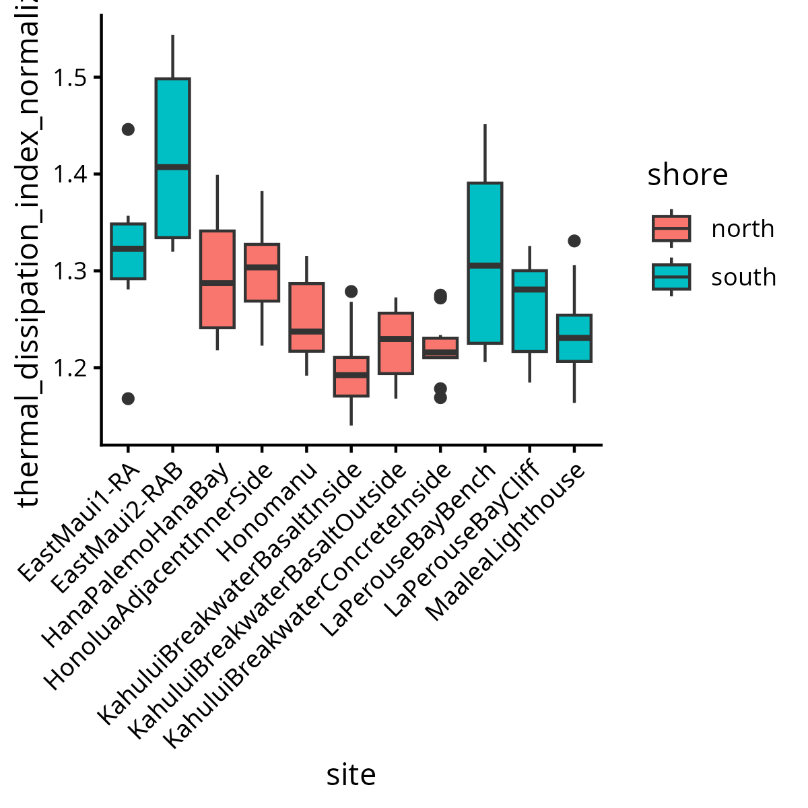
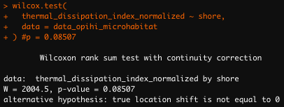
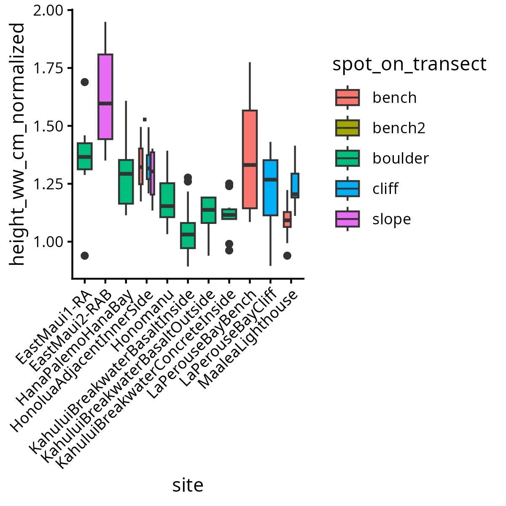
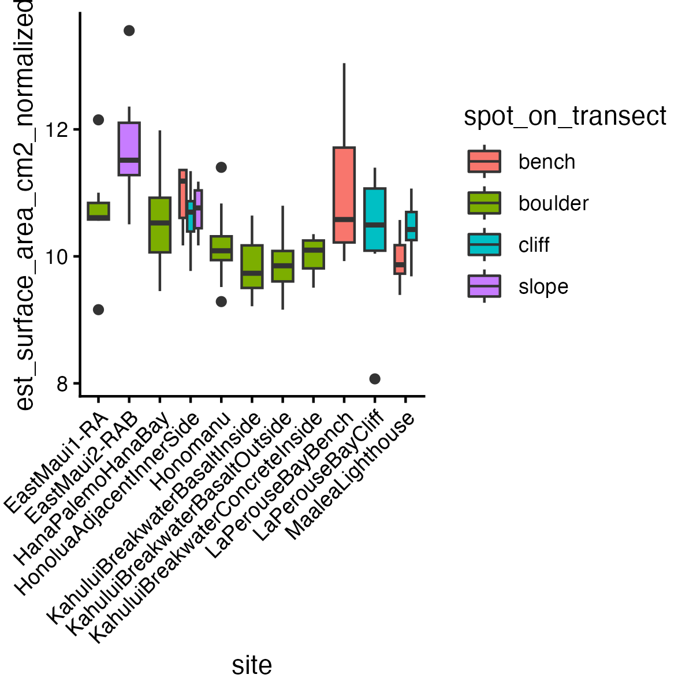
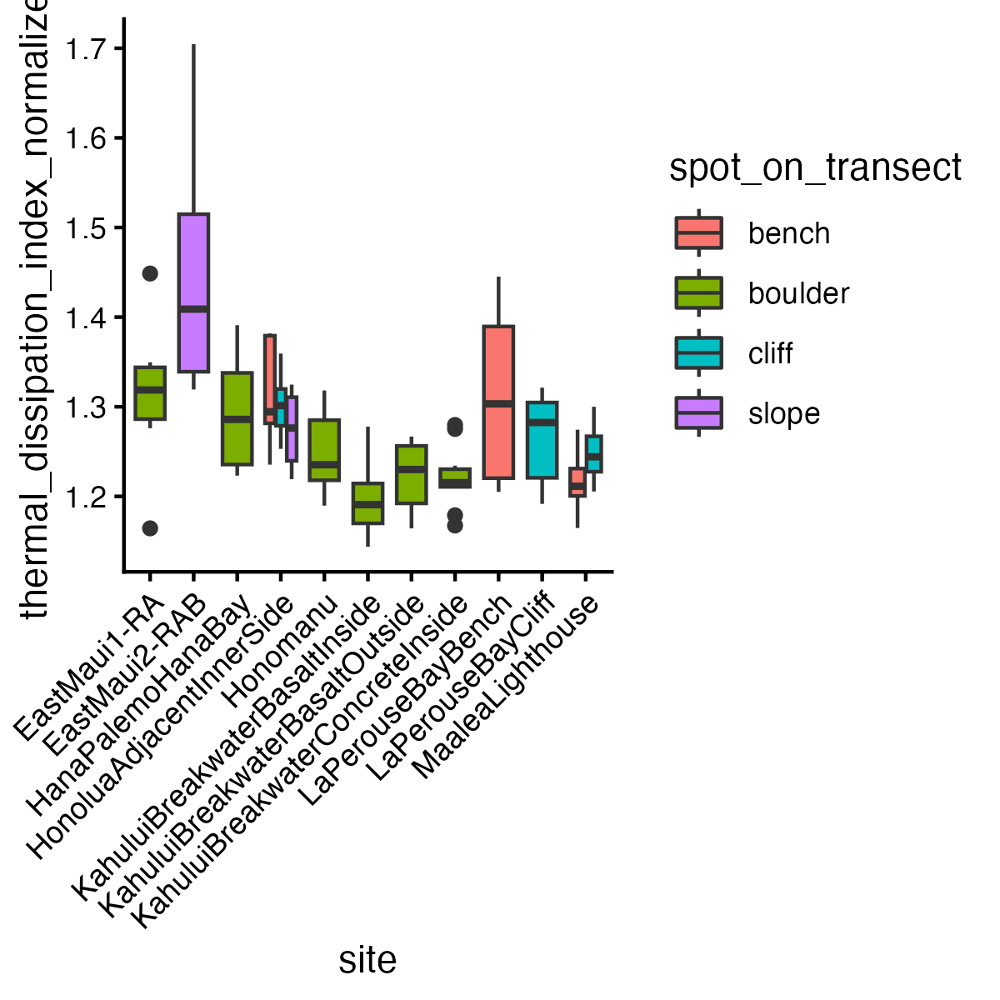

# Output Directory Documentation

This directory contains the output and results for hypothesis 3: is habitable area correlated with shell shape?

## Figure Catalog

### Figure 16. Normalized Height by North/South Shore

### Figure 17. Normalized Surface Area by North/South Shore

### Figure 18. Normalized Thermal Dissipation Index by North/South Shore

### Figure 19. Normalized Height by Shore Type

### Figure 20. Normalized Surface Area by Shore Type

### Figure 21. Normalized Thermal Dissipation Index by Shore Type

