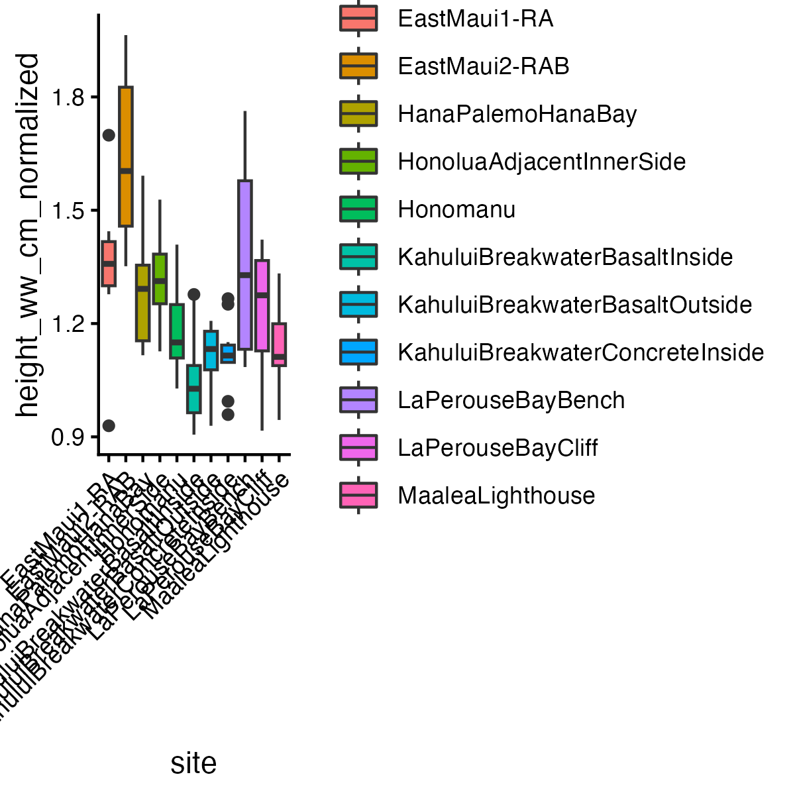
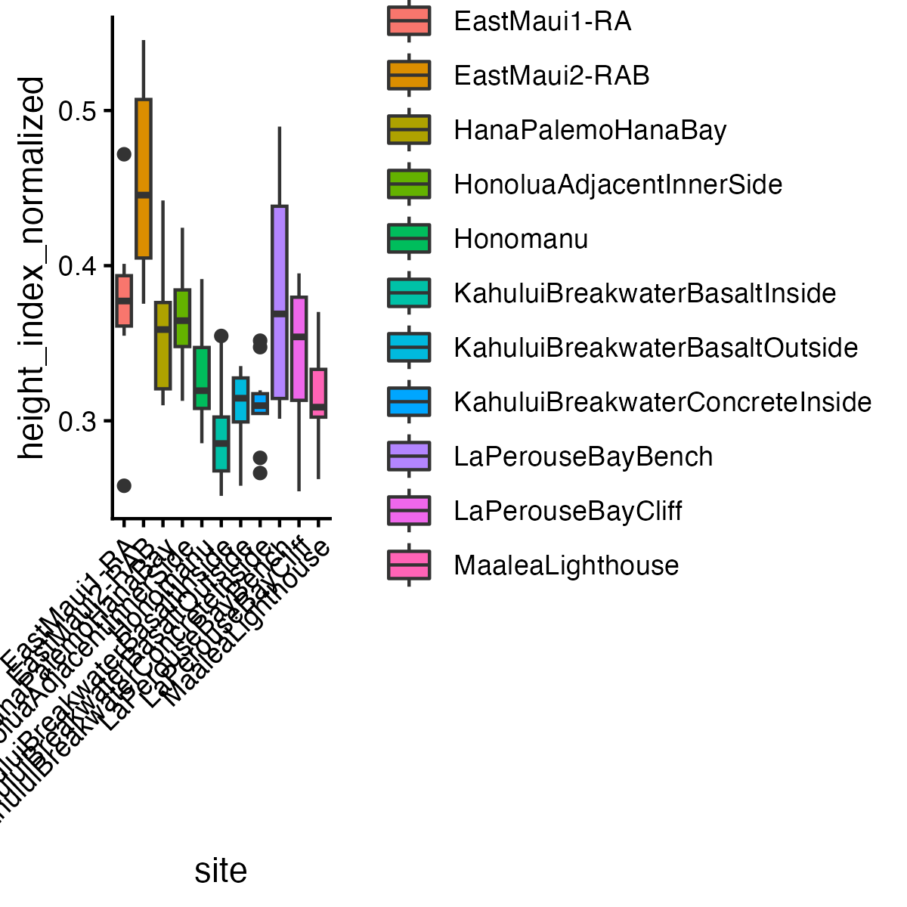
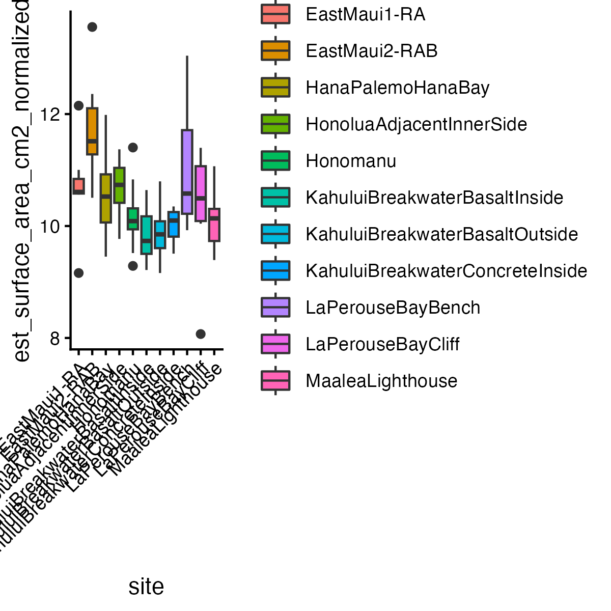
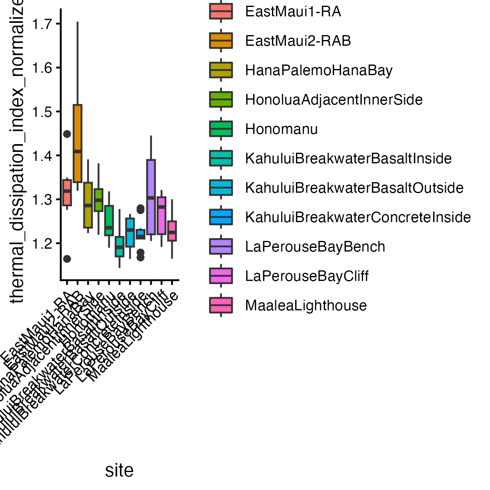

# Output Directory Documentation

This directory contains results relating to hypothesis 2: does phenotypic variation vary among sampling locations?

## Figure Catalog

### Figure 4. Normalized Shell Height by Site

Boxplots of normalized shell height by site. The plot shows site-level variation in shell height after accounting for shell length.

### Figure 5. Normalized Height Index by Site

Boxplots of normalized height index by site. This figure compares relative shell height across sites rather than raw body size.

### Figure 6. Normalized Estimated Surface Area by Site

Boxplots of estimated normalized shell surface area by site. The figure is used to compare surface-area-related morphology among locations after length normalization.

### Figure 7. Normalized Thermal Dissipation Index by Site

Boxplots of normalized thermal dissipation index by site. Higher values indicate greater estimated surface area relative to cross-sectional area.
