# Output Documentation

This contains output related to hypothesis 1: does thermal refuge proximity affect shell shape?

## Figure Catalog

### Figure 8. Normalized Thermal Dissipation Index by Distance to Shelter

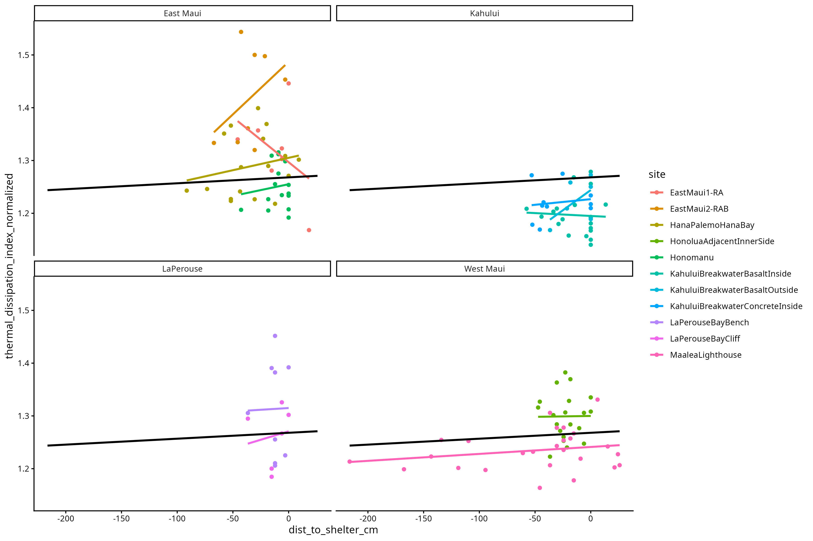

Scatterplot of normalized thermal dissipation index by distance to shelter with linear smooths. Positive slopes indicate increasing ability to dissipate heat as shelter proximity increases. Black line is overall best fit.

### Figure 8 Statistical Results

Tried to do an lme, model creation worked fine with no interaction between sites, couldn't reach a convergence when interaction was included, even after 1000 iterations.

Was able to do contrast tests though.

EastMaui1-RA vs HanaPalemoHanaBay

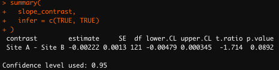

EastMaui1-RA vs EastMaui2-RAB

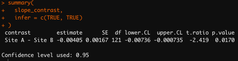

### Figure 9. Normalized Height Index by Distance to Shelter

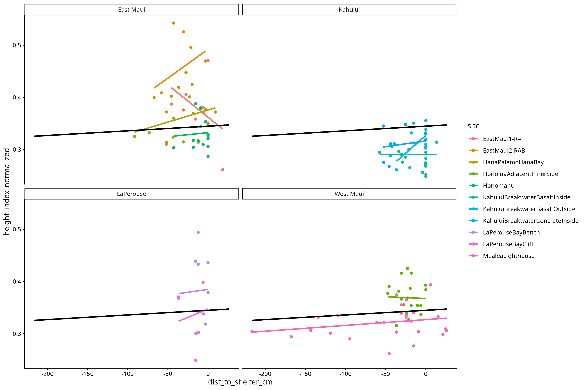

Scatterplot of normalized height index by distance to shelter, grouped by site, with linear smooths. Positive slopes indicate increasing shell height as shelter proximity increases.

### Figure 9 Statistical Results

EastMaui1-RA vs HanaPalemoHanaBay

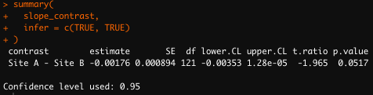

### Figure 10. Erosion by Distance to Shelter

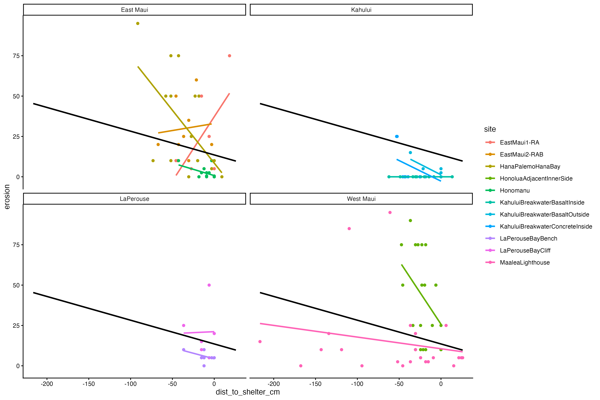

### Figure 11. Normalized Thermal Dissipation Index by Distance to Littoraria pintado

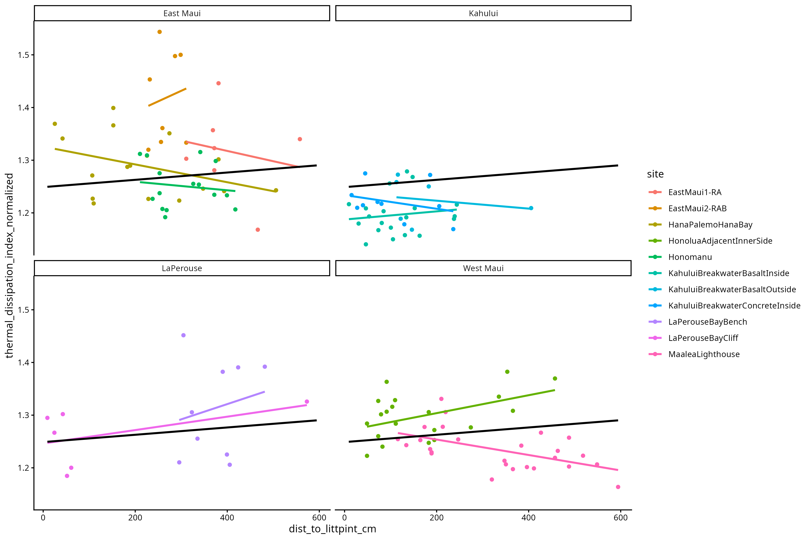

Linear models were made representing the relationship between thermal dissipation index and distance to the extremophile snail Littoraria pintado, one accounting for interactions between sites and one not accounting for such interactions. The ANOVA run was non significant. REPLACE THIS WITH A TABLE.

### Figure 11 Statistical Results

HanaPalemoHanaBay vs HonoluaAdjacentInnerSide

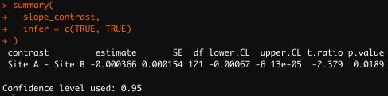

### Figure 12. Normalized Height Index by Distance to Littoraria pintado

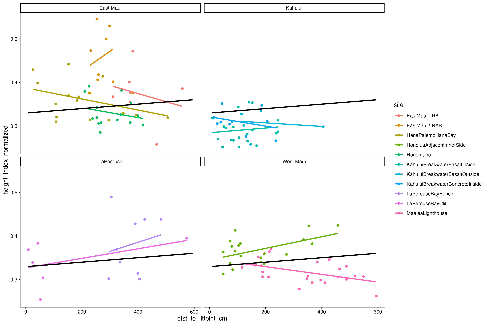

Linear models were made representing the relationship between height index and distance to the extremophile snail Littoraria pintado, one accounting for interactions between sites and one not accounting for such interactions. The ANOVA run was non significant. REPLACE THIS WITH A TABLE.

### Figure 14. Normalized Thermal Dissipation Index by Distance to Open Water

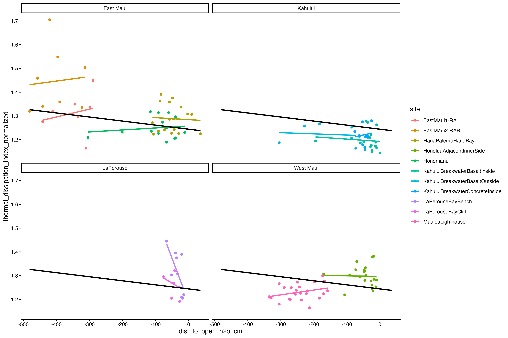

Scatterplot of normalized thermal dissipation index by distance to open water with linear smooths. Positive slopes indicate increasing thermal dissipation ability with increasing distance to open water.

### Figure 14 Statistical Results

EastMaui1-RA vs KahuluiBreakwaterBasaltInside

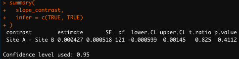

### Figure 22. Surface Area Deviation by Refuge Availability

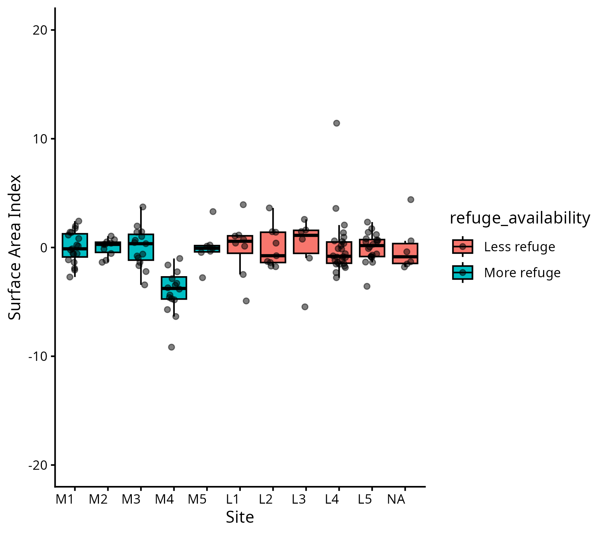

Site-level boxplots of deviation from mean normalized surface area, grouped by the script-defined refuge availability category. The figure suggests higher positive deviations in the “less refuge” group.

### Figure 13. Normalized Height Index by Percent Limu Shell Coverage

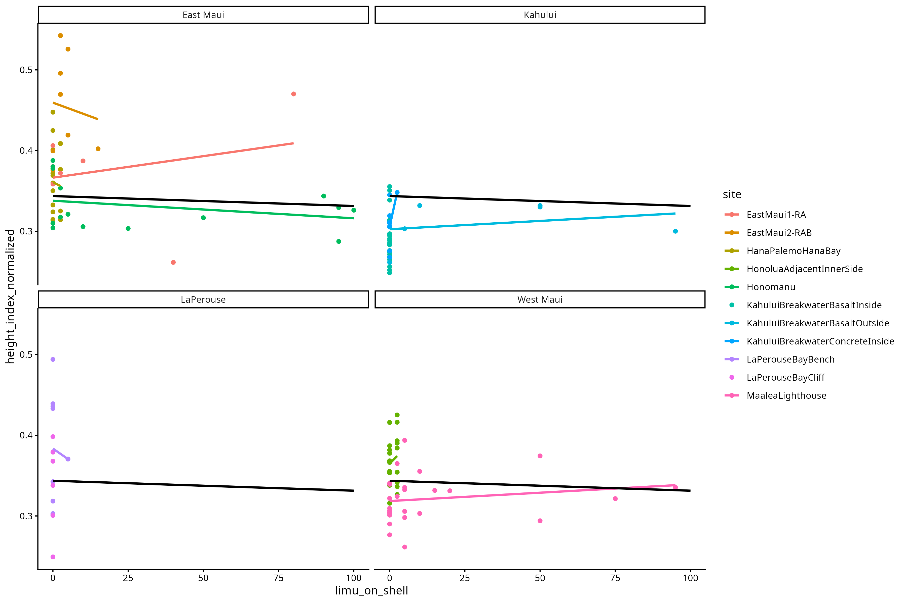

Scatterplot of normalized height index by percent limu shell coverage with linear smooths. Positive slopes indicate increasing shell height with increasing limu coverage.

### Figure 13 Statistical Results

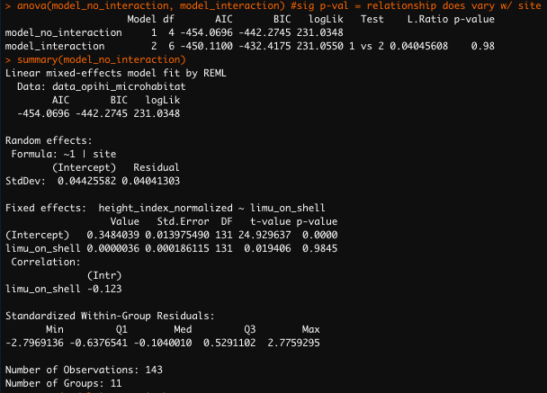

### Figure 15. Normalized Thermal Dissipation Index by Surface Angle

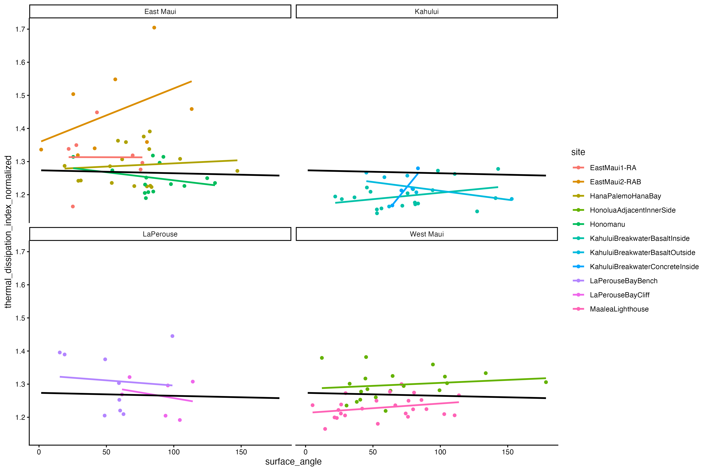

Scatterplot of normalized thermal dissipation index to surface angle with linear smooths. TABLE THIS OUT.

### Figure 34. Normalized Thermal Dissipation Versus Shelter Distance

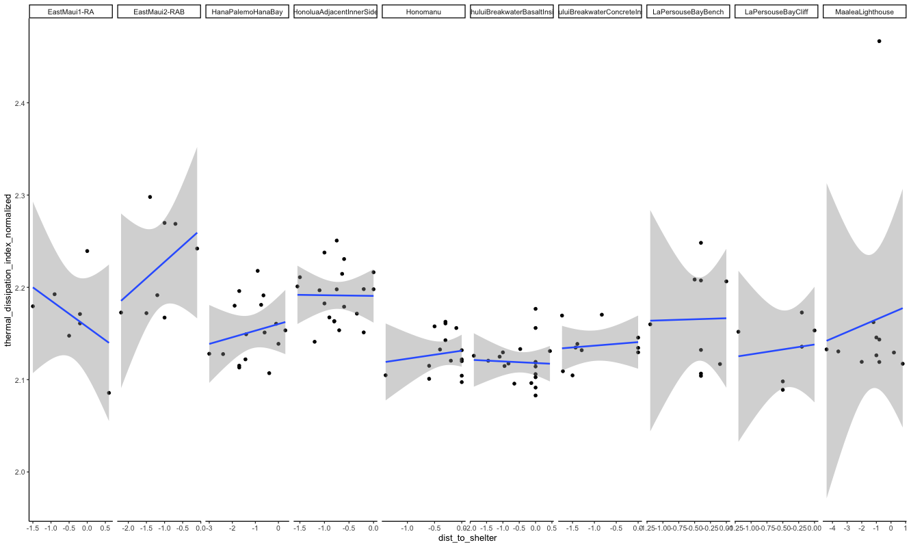

Faceted linear-model plot of normalized thermal dissipation index against distance to shelter. The relationships appear site-specific and noisy, with wide uncertainty in sites with limited observations.
